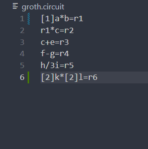
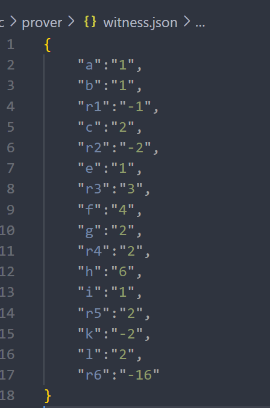
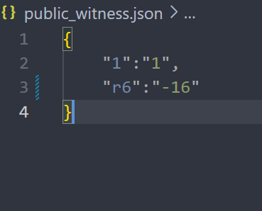

# Mini Groth16


## Description
Implementation of groth16.*Not suitable for production use*.

## Table of Contents
- [Installation](#installation)
- [Usage](#usage)
- [Improvements](#improvements)
- [Reference](#reference)

## Installation
Ensure you have [Rust](https://www.rust-lang.org/tools/install) and [Cargo](https://doc.rust-lang.org/cargo/) installed. To install the project, run:
```bash
git clone https://github.com/Saksham010/mini-groth16/
cd mini-groth16
```

## Usage

### Trusted setup
Specify your constraint/circuit for computation in groth.circuit file in root folder. Use [val] for negative coeff,ie: -1 => [1] Eg:



Run trusted setup to generate proving and verification key. *Doesn't support adding randomness*:
```bash
cargo run --bin setup
```
Two binary files *proving_key.bin* and *verification_key.bin* will be generated in the root directory

### Proof Generation
Honest prover will provide valid constraint/circuit for computation in gorth.circuit file that matches to that of the agreed circuit during trusted setup. In src/prover/witness.json provide all the values for involved variable in the circuit and their computed values. Eg:



Public witness will contain public values:



*Proof generated form the values that does not satisfy the constraint is rejected*

Generate proof by running:
```bash
cargo run --bin prover
```
Copy the proof string.

### Proof Verification
Honest verifier will run the recieved proof with the verifier algorithm.
```bash
cargo run --bin verifier REPLACE_WITH_PROOF
```
The verification algorithm will output whether the proof is valid or not in the console.

## Improvements
- [ ] Contribute randomess in the setup ceremony

## Reference
1. Groth16 paper: https://eprint.iacr.org/2016/260.pdf
2. Mathematical mechanics of groth16: https://kayleegeorge.github.io/math110_WIM.pdf
3. Rareskills: https://www.rareskills.io/post/groth16